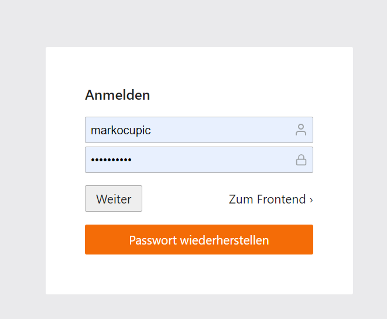
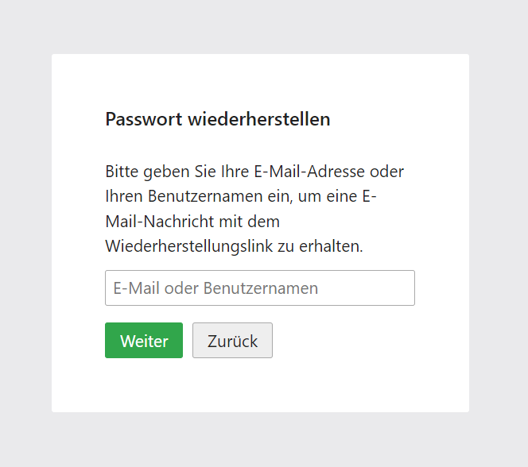
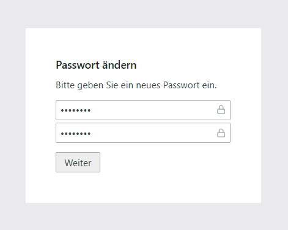

# Contao Backend Password Recovery Bundle
Senden Sie Benutzern niemals Passwörter über E-Mail. 

Dieses Plugin blendet **nach** falscher Eingabe des **Backend User Passwortes** einen "Passwort-Wiederherstellen-Button" ein. Durch Eingabe des Benutzernamens oder der E-Mail-Adresse wird dem User **eine E-Mail mit einem Link** zugesandt. Damit kann der Backend User sein Passwort neu erstellen.

## Installation
Via composer mit `composer require markocupic/backend-password-recovery-bundle`
oder Contao Manager. Nach der Installation das Install-Tool für das Datenbank Update laufen lassen.

## Bedienung
| Nach ungültiger Passworteingabe wird der "Passwort wiederherstellen Button" eingeblendet. | Benutzernamen oder E-Mail-Adresse eingeben. | Benutzer erhält eine E-Mail mit Link zugesandt und richtet sein neues Passwort ein. |
|-|-|-|
|  |  |  |

## Konfiguration
Nach der Installation ist keine weitere Konfiguration nötig.
Der **E-Mail-Betreff** und **E-Mail-Text** können über die **Sprachdatei** angepasst werden.

```
// contao/languages/de/default.php
$GLOBALS['TL_LANG']['MSC']['pwRecoveryEmailSubject'] = 'Lorem ipsum';
$GLOBALS['TL_LANG']['MSC']['pwRecoveryEmailText']  = 'Lorem ipsum';
```

Um die **Sicherheit** zu erhöhen beträgt die standardmässige **Gültigkeitsdauer** des **Links** 10 Minuten. Diese kann jedoch in der Datei  `config/config.yaml` angepasst werden.

```
# config/config.yaml
markocupic_backend_password_recovery:
    token_lifetime: 900 # default 600 (10 min)
```

Standardmässig wird der "Passwort wiederherstellen Button" **erst nach der Eingabe eines falschen Passwortes** eingeblendet. 
Dies lässt sich jedoch auch so anpassen, dass der Button **permanent sichtbar** ist.

```
# config/config.yaml
markocupic_backend_password_recovery:
    show_button_on_login_failure_only: false # Default true
```
