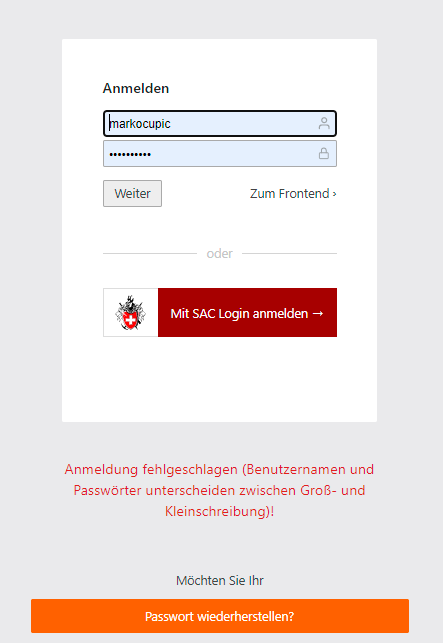
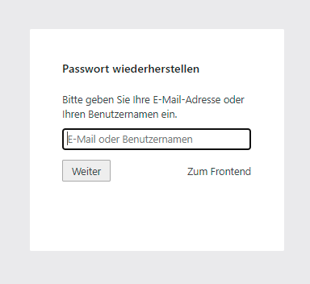
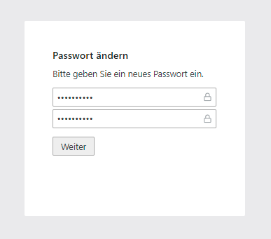

# Contao Backend Password Recovery Bundle
Dieses Plugin blendet bei falscher Eingabe des Backend Passwortes einen "Passwort wiederherstellen-Button" ein. Durch Eingabe des Benutzernamens oder der E-Mail-Adresse wird dem User eine E-Mail mit einem Link zugesandt. Hiermit lässt sich das Passwort neu setzen.

##Installation
Via composer mit `composer require markocupic/backend-password-recovery-bundle`
oder Contao Manager. Nach der Installation das Install-Tool für das Datenbank Update laufen lassen.

Danach ist keine weitere Konfiguration nötig.
|  |  |  |


## Wie bette ich den "Passwort vergessen" Link im Backend Login Template ein?
Mit  `$this->recoverPasswordLink` bekommst du im Login Template "be_login.html5" die url und mit `$this->forgotPassword` die Übersetzung.

 
```
<!-- be_login.html5 -->          
<div class="submit_container cf">
  <button type="submit" name="login" id="login" class="tl_submit"><?= $this->loginButton ?></button>
  <a href="/" class="footer_preview"><?= $this->feLink ?> ›</a>
  <br>
  /** Show password forgot link **/
  <a href="<?= $this->recoverPasswordLink ?>" class="footer_preview"><?= $this->forgotPassword ?> ›</a>
</div>

 
```