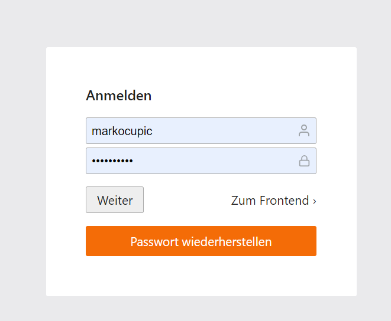
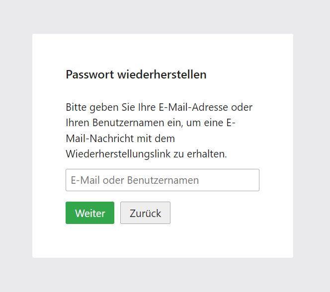
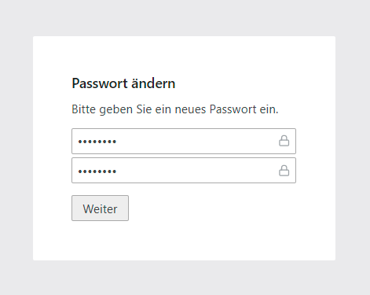

# Contao Backend Password Recovery Bundle

**Never send users passwords via email.**

This plugin displays a “recover password button” **after** incorrect entry of the **backend user password**.
By entering the user name or e-mail address, the user **is sent an e-mail with a link**.
This allows the backend user to restore their password.

## Installation

- On your console you can run `composer require markocupic/backend-password-recovery-bundle`
- Or you can install the extension via Contao Manager.
- Don't forget to run `bin/console contao:install` or the db migration tool in Contao Manager.

## Bedienung

| If an invalid password is entered, the “Restore password” button is displayed. | Enter your user name or e-mail address. | User receives an e-mail with a link and sets up their new password. |
|--------------------------------------------------------------------------------|-----------------------------------------|---------------------------------------------------------------------|
|                                           |    |                                |

## Konfiguration

No further configuration is required after installation.
The **email subject** and **email text** can be customized via the **language file**.

```
// contao/languages/de/default.php
$GLOBALS['TL_LANG']['MSC']['pwRecoveryEmailSubject'] = 'Lorem ipsum';
$GLOBALS['TL_LANG']['MSC']['pwRecoveryEmailText']  = 'Lorem ipsum';
```

To increase **security**, the default **validity period** of the **link** is 10 minutes. However, this can be adjusted in the `config/config.yaml` file.

```
# config/config.yaml
markocupic_backend_password_recovery:
    token_lifetime: 900 # default 600 s (10 min)
```

By default, the “Restore password” button **is only displayed after an incorrect password** has been entered.
However, this can be adjusted so that the button is **permanently visible**.

```
# config/config.yaml
markocupic_backend_password_recovery:
    show_password_recovery_link_on_login_failure_only: false # Default true
```
